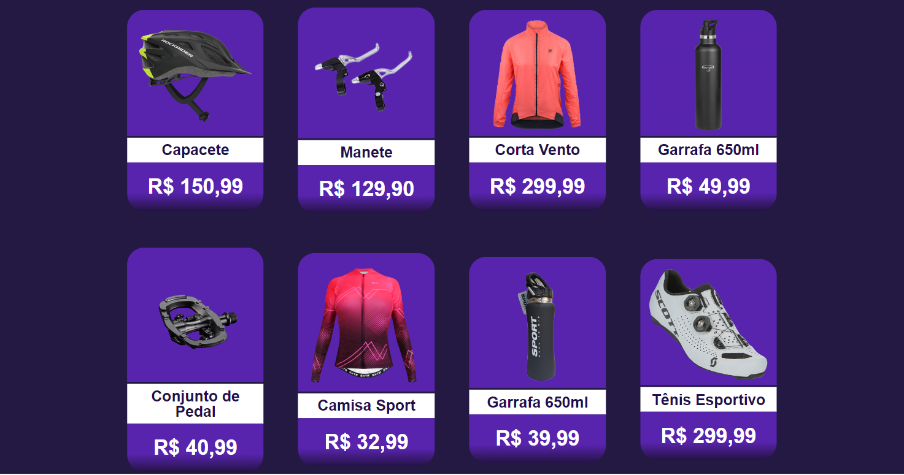

# Ártemis Bike 🚴‍♀️💨

Visualize o site em [artemis-bike.vercel.app](https://artemis-bike.vercel.app).
> ❔ Saiba mais sobre o projeto [aqui](https://artemisbike.vercel.app).

## Home: Eventos

Nesta tela, a ciclista pode se inscrever em trilhas de ciclismo previamente marcadas ou criar uma nova trilha.
Para isso, basta preencher as informações solicitadas no formulário de inscrição/cadastro.

## Loja

Nesta tela, a ciclista pode acessar todos os produtos disponíveis na loja do site.

### Tecnologias Utilizadas:
- HTML
- CSS
- JavaScript
- FrameWork React

### Requisitos de setup:
- [Node.js](https://nodejs.org/en/docs)

